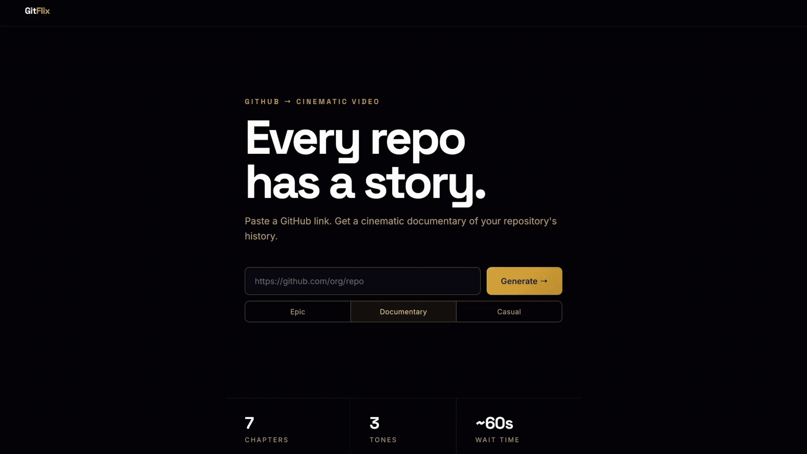

# GitFlix

**Every repository has a story worth telling.**

Live at [gitflix.netlify.app](https://gitflix.netlify.app)

[](https://deepwiki.com/MoSahil147/GitFlix)

GitFlix turns any public GitHub repository into a cinematic documentary, complete with animated scenes, commit analytics, a generated narrative and a full soundtrack. Paste a URL, pick a tone and watch your codebase come alive on screen.



## Open for contributions

This project is open to contribute and improve. You can suggest ideas, report bugs, or request features.

- Open an issue for bugs or ideas
- Submit a pull request with improvements
- Share feedback on features or UX

See [CONTRIBUTING.md](CONTRIBUTING.md) for setup instructions, branch naming, commit style, and code guidelines.

---

## What it does

GitFlix analyses a repository's commit history and produces a seven-scene short film:

| Scene | Title | What it shows |
|-------|-------|---------------|
| S01 | The Origin | When and by whom the project began |
| S02 | The Cast | The top contributors and their commit share |
| S03 | The Rise | A live-animated donut chart of commit distribution |
| S04 | The Plot Twist | The single most dramatic week of activity |
| S05 | Ghost Towns | Files that have not been touched in over 180 days |
| S06 | The Hero Moment | The one commit that changed the most lines |
| S07 | The Finale | Final statistics and a closing card |

Each scene has fade transitions, per-scene subtitles and a background score that fades out cleanly at the end.

---

## Tech stack

**Backend**
- [FastAPI](https://fastapi.tiangolo.com/) — REST API and Server-Sent Events streaming
- [PyGitHub](https://pygithub.readthedocs.io/) — GitHub data ingestion
- [LangChain + Groq](https://python.langchain.com/) — LLM-powered narration via `llama-3.1-8b-instant`
- [Pydantic v2](https://docs.pydantic.dev/) — typed data schemas throughout

**Frontend**
- [React 19](https://react.dev/) + [TypeScript](https://www.typescriptlang.org/) + [Vite](https://vitejs.dev/)
- [Remotion 4](https://www.remotion.dev/) — programmatic video rendered in the browser
- [Space Grotesk + Inter](https://fonts.google.com/) — typography

---

## Getting started

### Prerequisites

- Python 3.11+
- Node.js 18+
- A GitHub personal access token (for the GitHub API)
- A Groq API key (for LLM narration)

### 1. Clone the repository

```bash
git clone https://github.com/your-username/gitflix.git
cd gitflix
```

### 2. Set up the backend

```bash
cd backend
uv sync
source .venv/bin/activate        # Windows: .venv\Scripts\activate
```

Create a `.env` file in the `backend/` directory:

```env
GITHUB_TOKEN=your_github_personal_access_token
GROQ_API_KEY=your_groq_api_key
```

Start the API server:

```bash
uv run uvicorn main:app --reload
```

The API will be available at `http://localhost:8000`.

### 3. Set up the frontend

```bash
cd frontend
npm install
```

Create a `.env` file in the `frontend/` directory:

```env
VITE_API_URL=http://localhost:8000
```

Start the dev server:

```bash
npm run dev
```

Open `http://localhost:6767` in your browser.

> [!NOTE]
> If port 6767 is occupied (macOS reserves it for a system process on some machines), Vite will automatically move to 6768. Check the terminal output for the exact URL.

---

## Usage

1. Enter a public GitHub repository URL, e.g. `https://github.com/MoSahil147/GitFlix`
2. Select a tone — **Epic**, **Documentary**, or **Casual**
3. Click **Generate →**
4. Watch the stage progress as the backend fetches data, runs analytics, and writes the script (~60 seconds)
5. The film plays automatically once ready — use the chapter strip below the player to jump between scenes

---

## API reference

| Method | Endpoint | Description |
|--------|----------|-------------|
| `GET` | `/generate/stream` | Streams SSE progress events, then delivers the full script on completion |
| `POST` | `/generate/cancel` | Cancels an in-progress generation |
| `GET` | `/status` | Health check — returns `ok` or `degraded` with missing config details |

> [!NOTE]
> **For contributors:** This endpoint is intentionally named `/status` and not `/health`. Browser-based ad blockers silently block requests to URLs containing the word `health` (treating them as tracking or analytics calls) before the request ever leaves the browser.<br>This caused the frontend to report the backend as unreachable even when the server was running perfectly — no backend logs, no CORS error, just a silent client-side block. Renaming to `/status` fixed it immediately.

### SSE event shape

```json
{ "stage": "ingestion", "pct": 5,   "msg": "Fetching repo data…" }
{ "stage": "analytics", "pct": 30,  "msg": "Analysing commit history…" }
{ "stage": "agent",     "pct": 55,  "msg": "Writing the script…" }
{ "stage": "done",      "pct": 100, "data": { ...ScriptJSON } }
```

---

## Project structure

```
gitflix/
├── backend/
│   ├── ingestion/          # GitHub API client — fetches commits, contributors, file history
│   ├── analytics/          # Derives eras, ghost files, hero commit, plot twist
│   ├── agent/
│   │   ├── director.py     # Orchestrates parallel LLM narration across all 7 scenes
│   │   └── llm_balancer.py # Round-robin load balancer across Groq models
│   ├── schemas.py          # Pydantic models: ScriptJSON, Scene, Character, HeroCommit, …
│   └── main.py             # FastAPI app, SSE stream endpoint, rate limiter, cache
│
└── frontend/
    └── src/
        ├── remotion/
        │   ├── GitflixVideo.tsx    # Root composition — sequences all 7 scenes with music
        │   ├── Subtitle.tsx        # Animated subtitle component
        │   └── scenes/             # S01–S07 individual scene components
        ├── screens/
        │   ├── InputScreen.tsx     # Landing page — URL input, tone picker, stats
        │   ├── LoadingScreen.tsx   # Generation progress with stage indicators
        │   ├── PreviewScreen.tsx   # Player, chapter strip, export button
        │   └── ErrorScreen.tsx     # Error state with retry
        ├── components/
        │   └── NavBar.tsx          # Shared sticky nav with violet accent bar
        ├── App.tsx                 # State machine — routes between the four screens
        └── main.tsx
```

---

## Environment variables

| Variable | Where | Purpose |
|----------|-------|---------|
| `GITHUB_TOKEN` | `backend/.env` | GitHub API access (avoids rate limiting) |
| `GROQ_API_KEY` | `backend/.env` | LLM narration via Groq |
| `VITE_API_URL` | `frontend/.env` | Backend base URL (defaults to `http://localhost:8000`) |

---

## Deployment

The backend is a standard ASGI app and can be deployed to any platform that supports Python — Render, Railway, Fly.io, etc.

The frontend builds to a static site (`npm run build`) and can be deployed to Vercel, Netlify, or any static host.

If deploying behind nginx, ensure SSE is not buffered:

```nginx
proxy_buffering off;
proxy_cache off;
```

The backend already sends `X-Accel-Buffering: no` and `Cache-Control: no-cache` headers for Render compatibility.

---

## Licence

GNU General Public License v3.0 — see [LICENSE](LICENSE) for details.
